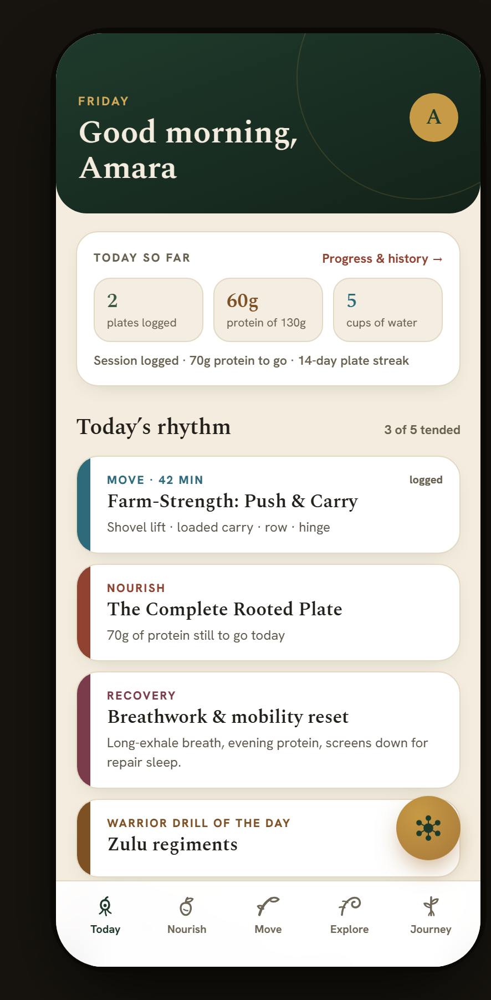
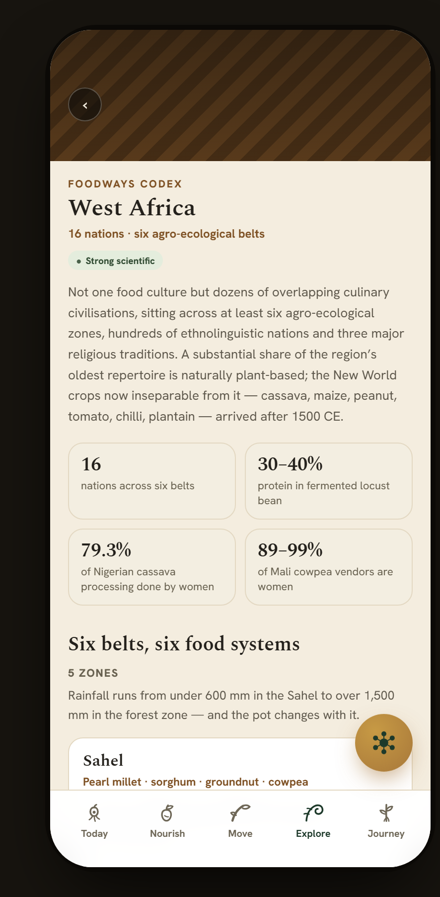
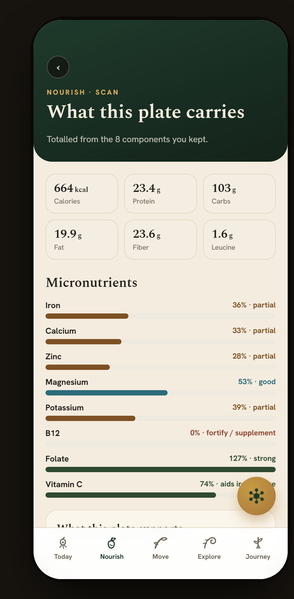
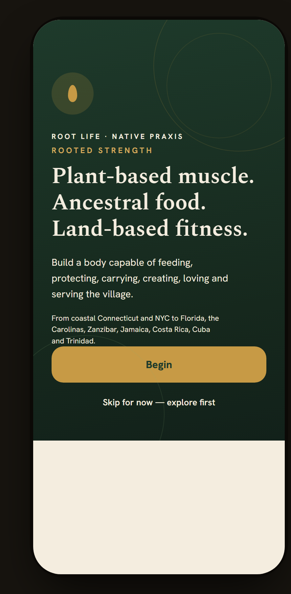

# Rooted Strength — app

React + Vite + TypeScript implementation of the design handoff in
`../design_handoff_rooted_strength/`.

| Today | Foodways Codex | Plate scan report |
|---|---|---|
|  |  |  |

<p align="center">
  
</p>

Captured from the running app at 393×852 — the resolution the design was drawn
at. No mockups: these are headless-Chrome screenshots of the real build.
More in **[docs/screens.md](docs/screens.md)**, including all eleven Move
screens.

```bash
npm install
npm run dev        # http://localhost:5178
npm run typecheck
npm run contrast   # AA audit of both palettes
npm run h1         # every route has exactly one <h1>
```

## Where things live

| Path | What it is |
|---|---|
| `src/theme/tokens.css` | Every design token, light and dark, plus the a11y modifiers |
| `src/theme/global.css` | Reset, keyframes, reduced-motion, 44px hit areas, focus rings |
| `src/data/content.ts` | 120 content definitions, **ported verbatim** from the prototype |
| `src/data/initialState.ts` | Seed state, including the 14-day log script |
| `src/data/tiers.ts` | The three tier vocabularies, with light + dark pairs |
| `src/state/store.tsx` | App state, navigation stack, logging |
| `src/state/selectors.ts` | Derived values — plate filtering, the nutrient report |
| `src/state/kitchen.ts` | Pantry drawdown, grocery swaps, order gaps, smoothie totals |
| `src/state/move.ts` | Session logging, weekly movement counts, elder dose |
| `src/components/TabbedGuide.tsx` | The tab-selector pattern nine Explore surfaces share |
| `src/state/journal.ts` | Streaks, week strip, protein trend, history timeline |
| `src/nav/routes.ts` | All 86 routes and their tab groupings |
| `src/components/` | Shell, tab bar, FAB, Council sheet, tier badge, UI primitives |
| `src/screens/` | Implemented screens |
| `docs/DISCREPANCIES.md` | Where the handoff contradicts itself, and what was decided |

## What is implemented

All eight build-order steps from the handoff. **All 86 routes.**

- **Shell & navigation** — 393×852 surface, tab bar, Council FAB, real history
  stack, `rs-fade` route transitions, chrome hidden on onboarding
- **Both themes** — dark is a real token palette, *not* the prototype's
  `filter: invert(1)` shortcut, and is contrast-verified independently
- **Accessibility** — all 11 toggles wired; reduced motion honours both the OS
  setting and the in-app switch; 44px hit targets; icon controls labelled; tier
  meaning announced rather than implied by colour; reflow verified at 200% text
  and at 320px width, with no clipping and no sideways scroll
- **Tier badge system** — one component, three vocabularies, redundant glyph
  encoding when colour-blind-safe mode is on (it is on by default)
- **Data layer** — the full content corpus, copy untouched
- **Codex** — `codex`, `codexRegion`, `pantryCodex`, `pantryVol`
- **Onboarding** — all seven steps, skippable and revisitable, with the recap
  linking back into each and `profileReturn` re-entry for profile edits
- **Today** — every figure computed from the log set
- **Nourish — complete.** Hub; the scan chain `scan → detected → hidden → report`;
  `recipe` / `recipeDetail` / `sugarMeal`; `mealPlan`; `pantry`; `grocery` and
  `planGrocery`; `barcode` and `voice`; `restaurant` / `order`; and
  `smoothies` / `smoothieBuilder`
- **Move — complete.** Hub; `farm`; `exercise` (three variants incl. seated);
  `trainPlan`; `warrior`; `mobility`; `seated`; `elder`; `ancestral`; `breath`;
  `hike`. Every session screen logs a real entry that Today and the weekly
  counts read back
- **Explore — complete.** Atlas hub; `crop`; `map`; `forage`; `community`;
  `seasonal` (five bioregions, resolved against the real month); `minerals`;
  `frequencies`; `fusion`; `apothecary`; `teaIntel`; `mushrooms`; and the nine
  tabbed guides (`nervines`, `waterMed`, `ferment`, `swaps`, `diabetes`,
  `ceremony`, `coconut`, `honey`, `shroomRecipes`) built on one shared component
- **Journey — complete.** Hub; `progress` and `history` (both computed from the
  log set); `profile`; `sources` (all 66, graded by the shared badge); `privacy`;
  `dataSov`; `vault`; `membership`; `sovereignty`; `admin`; `sleep`;
  `pregnancy` (a real blocking clinician gate); `intimacy`
- **Farm & the rest — complete.** `microgreens`; `croplib` (searchable, filtered,
  with sow advice resolved against the real month); `variety`; `garden`;
  `pairings`; `budget`; `hydration`; `filters`; `family`

## Coverage

All 86 routes are implemented, wired and reachable — every route has at least one
inbound link from a screen or a tab, and no link lands on a placeholder. There is
no longer a "not built yet" screen in normal use; `NotBuiltYet` remains in
`App.tsx` only as a fallback for an unknown route string.

Verified mechanically:

```bash
npm run typecheck && npm run contrast && npm run h1
```

## Rules that are load-bearing, not stylistic

These are enforced in code, and breaking them is a correctness bug:

1. **Nothing is filtered silently.** Excluded plates are counted *and* listed
   with the reason. Flagged brews sort last with the reason shown, never removed.
2. **Generative surfaces compute.** The nutrient report sums the actual kept
   components — drop a food and every macro, micro and sentence changes. The
   recipe generator cycles `genIdx` so a result never repeats early.
3. **Copy is not edited.** `content.ts` is verbatim. Several passages are worded
   precisely to avoid claiming more than the evidence supports. If a layout
   forces a cut, flag it for editorial review instead of trimming.
4. **A dish is never relabelled to suit a diet.** The classification tiers are
   distinct claims about history, not synonyms.

## Reflow

The handoff's one outstanding structural item; now closed. Every screen was
checked at 200% text scale and at a 320px viewport — no sideways scroll, no
clipped labels.

The fixes were structural rather than per-screen:

- grid tracks use `minmax(0, 1fr)` so a track can shrink below its content
- flex items carrying text can shrink (`min-width: 0`, no `flex: none`)
- a global `overflow-wrap: break-word` lets a word longer than its container
  break instead of being clipped by the fixed-width frame
- tier badges and chips wrap rather than truncate, because a shortened evidence
  label would change what it claims

One visible trade-off: the longest classification label wraps to two lines in a
dish row at normal size. There is no room for it and the dish title on one line
at 393px — before this change the title wrapped instead.
